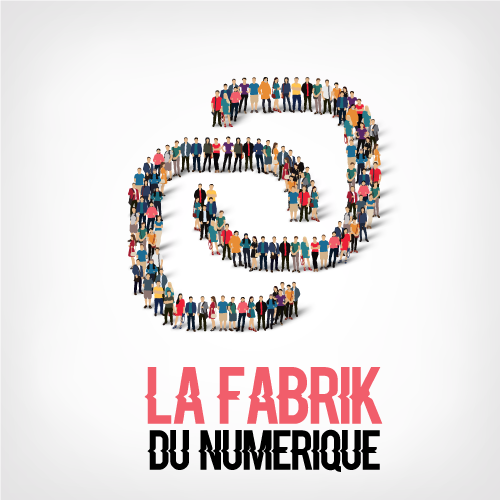
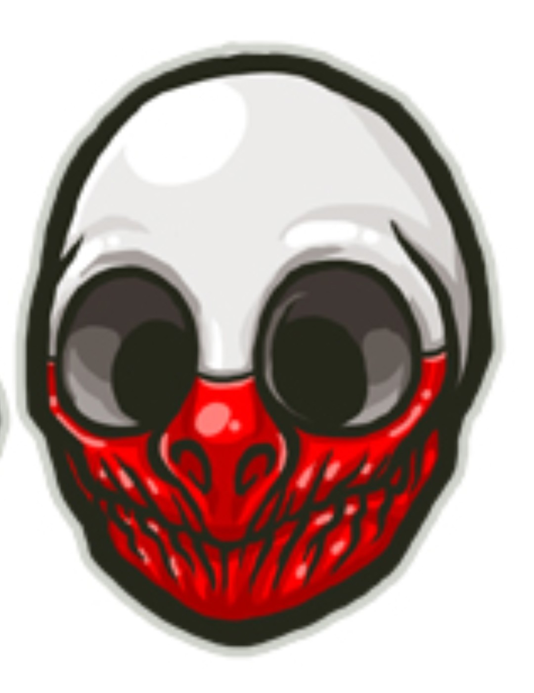

### Welcome to my Github profile !! 

 
Active member of a wonderful community named "La Fabrik du numérique". This community is about digital and regroup more than 1000+ developers, recruiters, designers, testers, data scientists, CTO, CEO, PO, MOA, freelances etc... We are sharing knowledges, tips, and helping each other in a perfect benevolence.

👋 I am Guillaume, a 32 years old developer. 

🔭 I have always been keen on screens, high-technology gadgets, video games, connected stuffs.

👯:heart_eyes_cat::dancing_men: After 13 years working as a youth leader and as a High-tech customer service representative (I appreciate human contact), I have decided to retraining myself with IT development.

🌱 I am very new in this field, this is the beginning of a long story, but I love to learn new things everyday, and as in my personal life, I like to find solutions for any problem I encounter. 

😄 PHP and Symfony are my best friends for now (also interested in Vue.js), their documentations are well done, swap knowledges with others is also a good thing to grow up within web development. 

💬 For one year I have realized several projects, some are private because of sensitive informations but if you ask me, it would be a pleasure to discuss about process, code, or anything else. I am also still making 2 E-commerce projects to increase my skills. :muscle:

📫 You can find me in [LinkedIn](https://www.linkedin.com/in/guillaumegeorges/), [StackOverflow](https://stackoverflow.com/users/13133575/metaljk), [My own website](https://www.guillaumegeorges.fr)

  More personal infos : I love to cook for my family, to try to make some music and discover things. Did I already speak about video games? 
 

<!--
**Metaljunkfr/Metaljunkfr** is a ✨ _special_ ✨ repository because its `README.md` (this file) appears on your GitHub profile.

Here are some ideas to get you started:

- 🔭 I’m currently working on ...
- 🌱 I’m currently learning ...
- 👯 I’m looking to collaborate on ...
- 🤔 I’m looking for help with ...
- 💬 Ask me about ...
- 📫 How to reach me: ...
- 😄 Pronouns: ...
- ⚡ Fun fact: ...
-->
